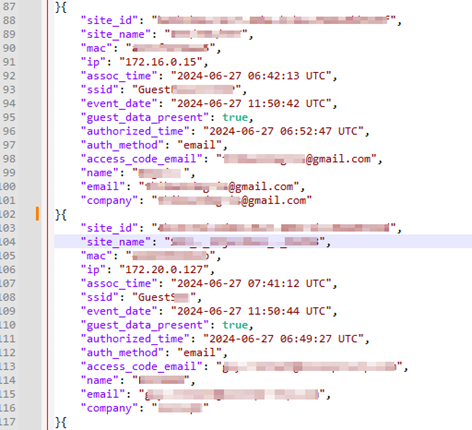

# Juniper Mist - Guest logger

Python script to log guest clients data from a Juniper Mist Wi-Fi infrastructure
For legal purposes in France (guest Internet access log retention for a year)



Authors: Jonathan Rambeau

Date: 03 jan 2025

Changelog:
- 27 jun 2024: creation
- 03 jan 2025: solved an issue where too many API calls where being made and triggered throttling (when getting guest client details using RESTFUL APIs) 

## 1. Installation

1. Install python
2. Check if pip is installed ``` python -m pip --version ```. If not installed, install it: https://pip.pypa.io/en/stable/installing/
3. Upgrade pip ``` python.exe -m pip install --upgrade pip ```
4. Install additionnal required libraries:
    1. ```pip install -r requirements.txt```
5. Customize file apivariables.py with your API Token and Organization ID. I recommend using a Token generated from a service account of your Organization (and not an actual user account)

## 2. Customize

There is a very important line on this script that is used to filter on the actual guests or any client connecting to the guest SSID. We don't want to log information about users connected to SSIDs others than the Guest SSID. And there are two ways to do that:
- I look for the [is_guest] tag from the client information. If the tag is present, we are definitely looking at a guest and we want to log that.
- Sometimes the [is_guest] tag is not present, for example with manually registered guest. In that case, I am also looking for some keywords on the SSID name to try and catch the Guest SSID: "invite", "guest", "hotspot". Of course, you should modify these if they are not going to match your infrastructure.

```python
```Line 86
```if (message.get('data', {}).get('is_guest')) or ('guest' in message['data'].get('ssid', '').lower()) or ('invite' in message['data'].get('ssid', '').lower()) or ('hotspot' in message['data'].get('ssid', '').lower()):
```

## 3. Run the script

1. From a terminal, start the script: ``` python mist-guest-logger.py ```
2. Alternatively, use the Powershell script ```.\run-mist-guest-logger.ps1``` if you want to configure a scheduled task on a Windows machine