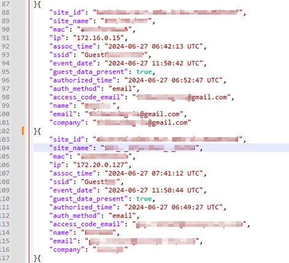
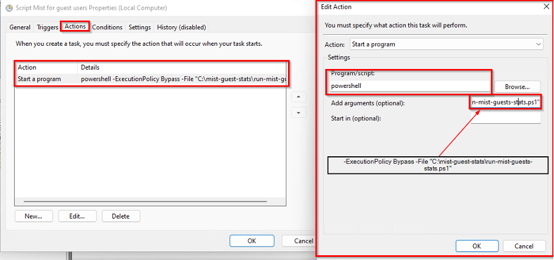

# Juniper Mist Guest logger - WebSocket version

Python script to log guest clients data from a Juniper Mist Wi-Fi infrastructure. Useful in France for legal purposes (guest internet access log retention for a year)



Changelog:
- 27 jun 2024: creation
- 03 jan 2025: solved an issue where too many API calls where being made and triggered throttling (when getting guest client details using RESTFUL APIs)
- 19 mar 2026: changed the way you configure your guest SSID. Now in config.py file

## 1. Installation

1. Install python
2. Check if pip is installed ``` python -m pip --version ```. If not installed, install it: https://pip.pypa.io/en/stable/installing/
3. Upgrade pip ``` python.exe -m pip install --upgrade pip ```
4. Install additionnal required libraries:
    1. ```pip install -r requirements.txt```
5. Customize file `config.py` with your API Token, Organization ID and guest SSIDs. I recommend using a Token generated from a service account of your Organization (and not an actual user account)

## 2. Customize

Edit the `config.py` file to configure the script for your environment:

```python
mist_url = 'https://api.eu.mist.com/api/v1/'  # Mist API URL
token = 'insert Token here'                    # API Token
org_id = 'insert Org ID here'                  # Organization ID

# List of guest SSIDs to monitor (case-insensitive matching)
guest_ssids = ['WIFI-GUEST', 'Visitor-WiFi']
```

The script identifies a guest client in two ways:
- The `is_guest` flag is present in the client data returned by Mist (always checked automatically).
- The client's SSID matches one of the SSIDs listed in `guest_ssids` (case-insensitive). This covers cases where the `is_guest` flag is absent, for example with manually registered guests.

You **must** populate `guest_ssids` with the exact SSID name(s) used for guest access on your infrastructure.

## 3. Run the script

1. From a terminal, start the script: ``` python mist-guest-logger.py ```
2. Alternatively, use the Powershell script ```.\run-mist-guest-logger.ps1``` if you want to configure a scheduled task on a Windows machine

